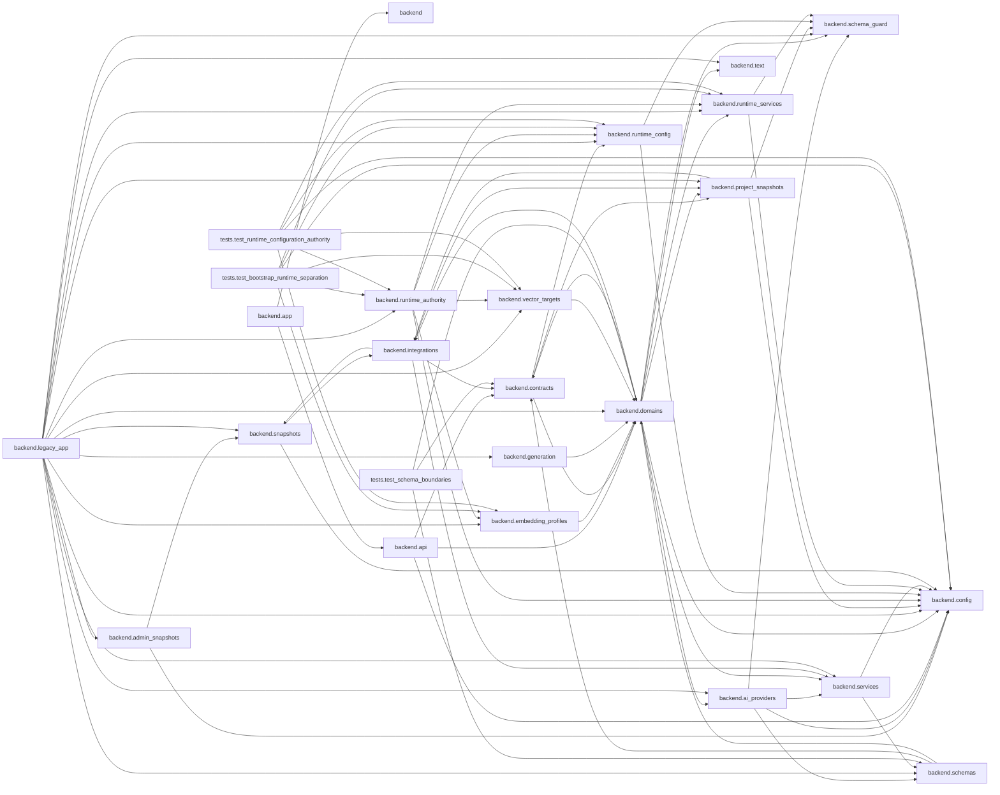

# api_test

## 이 프로젝트는

VS Code AI Code Assistant Backend는 VS Code 확장 프로그램에서 저장소를 업로드하고 질문하면, FastAPI가 원문 보관·청킹·BGE-M3 임베딩·Qdrant 검색·프롬프트 조립을 수행한 뒤 선택된 backendAI 또는 NVIDIA 모델로 근거 기반 답변을 생성합니다. 이 프로젝트는 frontend 팀이 관리하는 VS Code Extension 프로젝트와 별도로, BackendAPI 팀이 공개 API 계약과 Swagger/OpenAPI 문서만 참고하여 구현하고 있습니다.

## 문서 요약

- **`README.md`** — 이 문서는 VS Code AI Code Assistant Backend 프로젝트의 작업 보고서를 요약하고 있습니다. 신입 개발자가 프로젝트의 구조, 주요 기능 및 구현 내용을 이해하기 위해 이 문서를 읽어야 합니다 [1].
- **`deploy/kubernetes/README.md`** — 이 문서는 Vision 프로젝트의 Kubernetes 배포를 설명하고 있습니다. 신입 개발자가 이 문서를 읽어야 하는 이유는, 이를 통해 프로젝트의 아키텍처와 배포 과정을 이해하고, 필요한 플랫폼 기능과 이미지 빌드, 비밀 관리, 배포 순서 등을 알 수 있기 때문입니다. [7]
- **`APPLY_NOTES.md`** — 이 문서는 Vision 프로젝트의 스냅샷 관리 변경 사항을 적용하는 방법을 설명하고 있습니다. 신입 개발자는 이 문서를 통해 프로젝트의 백엔드와 프론트엔드 코드 수정 내용을 이해하고, 관련 테스트를 수행하여 변경 사항이 올바르게 적용되었는지 확인할 수 있습니다 [8].
- **`IngestResponse 프로젝트 목록 조회 작업 계획.md`** — 이 문서는 `/v1/IngestResponse` 프로젝트 목록 조회 작업 계획을 설명하고 있습니다. 신입 개발자가 BackendAPI 구현과 관련된 작업을 이해하고, VS Code Extension의 동작 방식을 파악하기 위해 이 문서를 읽어야 합니다. [9]
- **`NORMALIZATION_MODULE_MIGRATION.md`** — 이 문서는 프로젝트의 정규화(Normalization) 모듈 분리와 마이그레이션 가이드를 설명하고 있습니다. 신입 개발자가 기존 코드 중복을 줄이고, 단위 테스트를 쉽게 만들 수 있도록 새로운 `backend/normalization.py` 모듈을 생성하고 사용하는 방법에 대해 알아야 합니다. [10]
- **`PHASE8_STABILIZATION.md`** — Phase 8의 안정화 과정을 설명하고, 신입 개발자가 프로젝트의 현재 상태를 이해하고 진행해야 하는 작업을 포함하고 있습니다. 이 문서는 신입 개발자가 프로젝트의 진행 상황과 다음 단계에 대한 정보를 얻는데 도움이 됩니다 [11].
- **`RAG_PROJECT_SNAPSHOT_INTEGRATION.md`** — 이 문서는 Vision 프로젝트와 RAG(Large Language Model) 사이의 통합 계약을 설명하고 있습니다. 신입 개발자는 이 문서를 통해 백엔드 측에서 진행 중인 세 가지 사전-AI 팀 단계(외부 프로젝트 등록, 스냅샷 수분화, 워크스페이스 Git 상태 비교)의 계약을 이해하고 구현해야 하는 방법을 배울 수 있습니다. [12]
- (예산 때문에 요약하지 않은 문서: `REFACTOR_PHASES.md`, `design-qa.md`, `requirements.txt`, `기능,요구사항 정의서/기능 정의서.md`, `기능,요구사항 정의서/요구사항 정의서.md`)

## 진입점

| 파일 | 판정 근거 |
|---|---|
| `main.py` | 파일명 규칙(main.py) · 최상위 근처 · 'if __name__ == "__main__"' 포함 |
| `backend/app.py` | 파일명 규칙(app.py) · 최상위 근처 |
| `backend/asgi.py` | 파일명 규칙(asgi.py) · 최상위 근처 |
| `backend/worker.py` | 최상위 근처 · 'def main' 포함 |
| `backend/worker_probe.py` | 최상위 근처 · 'if __name__ == "__main__"' 포함 |
| `ingest.py` | 최상위 근처 · 'if __name__ == "__main__"' 포함 |

## 진입점별 함수 목록

### `main.py`
- (함수 정의 없음 또는 파싱 실패)

### `backend/app.py`
포함된 라우터: `create_models_router`, `create_system_router`, `create_projects_router`, `create_snapshots_router`, `create_chat_router`, `create_repositories_router`

- L15 `def _route_method_path_keys(route: object) -> set[tuple[str, str]]` — Collect method/path keys from one direct or included-router route node.
- L31 `def _legacy_route_is_owned(route: object, routes: set[tuple[str, str]]) -> bool` — Return whether one legacy route node can be removed as a whole.
- L50 `def _remove_legacy_routes(routes: set[tuple[str, str]]) -> None` — Remove only routes whose ownership has moved out of the legacy module.
- L167 `def __getattr__(name: str) -> object` — Keep historical imports working while canonical owners are adopted.
- L175 `def __dir__() -> list[str]`

### `backend/asgi.py`
- L11 `def _trusted_proxy_hosts() -> list[str]`

### `backend/worker.py`
- L17 `def _stop(_signum: int, _frame: object) -> None`
- L24 `def _dispatch(task: QueuedTask) -> None`
- L67 `def _heartbeat(coordinator, consumer: str, status: str, task: QueuedTask | None, ttl: int) -> None`
- L79 `def main() -> None`

### `backend/worker_probe.py`
- L11 `def main() -> int`

### `ingest.py`
- L23 `def get_files_to_process(root_dir)`
- L35 `def chunk_file(file_path)`
- L67 `def main()`

## 기능 목록

- 사용자가 Sidebar의 `목록 새로고침`을 선택했을 때, Backend에 등록된 프로젝트명과 인덱싱 기준 Git 버전을 조회할 수 있도록 하는 API가 추가되었습니다. [1]

## 아키텍처 (모듈 import 관계)

