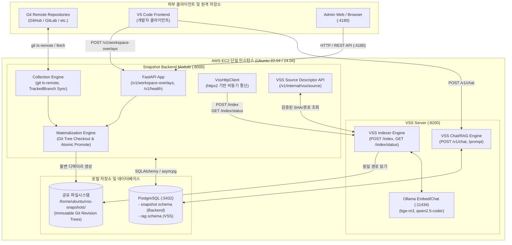
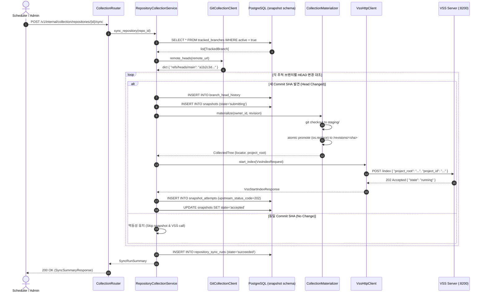
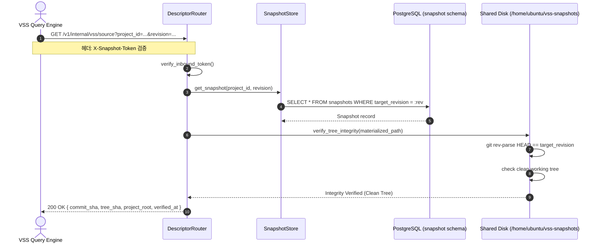
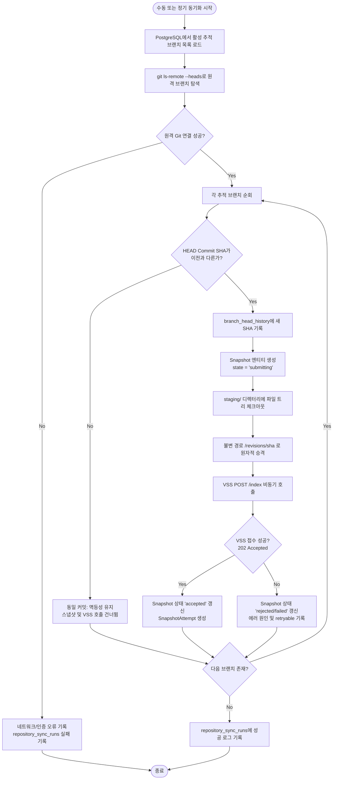

# Vision Snapshot Backend Module

> **"VSS 서버에 신뢰할 수 있는 Git 소스코드를 정확하고 안전하게 공급하는 백엔드 엔진"**

이 디렉터리는 `vss_server/main`의 VSS(Vector Search Server) 런타임과 소스코드가 섞이지 않는 **독립 Snapshot Backend 모듈**입니다.  
원격 Git 저장소의 브랜치를 추적(Fetch)하여 최신 Commit SHA를 수집하고, 전체 소스 트리를 불변(Immutable) 디렉터리로 Materialize한 후 VSS 서버의 인덱싱(`POST /index`)에 공급하는 역할을 담당합니다.

---

## 🎯 1. 시스템 설계 철학 (Architectural Principles)

본 시스템은 **"누가 보아도 쉽게 이해하고 안전하게 유지보수할 수 있는 엔터프라이즈급 아키텍처"**를 목표로 설계되었습니다:

1. **유지보수성 (방 나누기와 관심사 분리)**:
   * 5대 계층(인프라, 도메인, DB 영속화, VSS 연동, 공통 코어)이 완전히 분리되어 있어 한쪽을 수정해도 다른 쪽에 부수 효과(Side-effect)가 발생하지 않습니다.
2. **생산성 유지와 일관성 (레고 블록 구조)**:
   * 모든 입출력에 strict Pydantic 검증(`extra="forbid"`)과 표준화된 `ApiError` 응답을 적용하여 새로운 기능 확장이 용이합니다.
3. **무중단 안정성과 견고함 (Fail-Closed & 멱등성)**:
   * `(vss_project_id, target_revision)` DB 유니크 제약과 `os.replace` 원자적(Atomic) 파일 승격으로 네트워크 지연 및 장애 상황에서도 데이터 무결성을 보장합니다.
4. **자동화 테스트 기반 품질 보증 (131+ Automated Tests)**:
   * 15초 이내에 계약/단위/통합 테스트를 완벽히 통과하는 테스트 스위트를 구비하여 부실공사를 원천 차단합니다.

---

## 🏛️ 2. 시스템 아키텍처 다이어그램 (System Architecture)

### 2.1 시스템 배치도 (System Topology)



---

### 2.2 패키지 및 컴포넌트 구조도 (Component Architecture)

```mermaid
classDiagram
    namespace Core {
        class Settings {
            +SecretStr database_url
            +str vss_base_url
            +SecretStr vss_token
            +Path snapshot_materialization_root
            +Path snapshot_collection_root
        }
        class ApiError {
            +str reason
            +str detail
            +bool retryable
            +UUID request_id
        }
    }

    namespace Infrastructure_Database {
        class DatabaseEngine {
            +create_engine_from_url()
            +get_db_session()
        }
        class Repository
        class TrackedBranch
        class BranchHeadHistory
        class RepositorySyncRun
        class Snapshot
        class SnapshotAttempt
    }

    namespace Features_Collection {
        class GitCollectionClient {
            +remote_heads(remote_url)
            +ensure_mirror(remote_url, mirror_dir)
            +head_sha(mirror_dir, branch_ref)
            +is_ancestor(mirror_dir, ancestor, descendant)
            +checkout_tree(mirror_dir, revision, destination)
        }
        class CollectionMaterializer {
            +materialize(owner_id, snapshot_id, mirror_dir, revision)
        }
        class RepositoryCollectionService {
            +sync_repository(repository_id)
            +sync_all()
            +catalog(repository_id)
            +track_branch(repository_id, branch_ref, vss_project_id)
            +untrack_by_id(tracked_branch_id)
            +history(tracked_branch_id)
        }
        class CollectionRouter {
            +GET /v1/internal/collection/repositories/{id}/catalog
            +GET /v1/internal/collection/repositories/{id}/branches
            +POST /v1/internal/collection/repositories/{id}/branches
            +DELETE /v1/internal/collection/tracked-branches/{id}
            +POST /v1/internal/collection/repositories/{id}/sync
            +GET /v1/internal/collection/tracked-branches/{id}/history
        }
    }

    namespace Features_Snapshots {
        class SnapshotStore {
            +create_snapshot()
            +transition_state()
            +start_attempt()
            +finish_attempt()
        }
        class DescriptorRouter {
            +GET /v1/internal/vss/source
            +GET /v1/internal/vss/revisions
        }
    }

    namespace Integrations_VSS {
        class VssHttpClient {
            +start_index(request)
            +get_index_status(project_id)
            +get_health()
            +get_projects()
        }
    }

    CollectionRouter --> RepositoryCollectionService
    RepositoryCollectionService --> GitCollectionClient
    RepositoryCollectionService --> CollectionMaterializer
    RepositoryCollectionService --> SnapshotStore
    RepositoryCollectionService --> VssHttpClient
    RepositoryCollectionService --> DatabaseEngine : uses sessionmaker
    DescriptorRouter --> SnapshotStore
    SnapshotStore --> Snapshot
    SnapshotStore --> SnapshotAttempt
```

---

## ⚡ 3. 함수 아키텍처 및 상세 실행 플로우 (Sequence & Activity Flowcharts)

### 3.1 원격 브랜치 수집 ➔ 디스크 승격 ➔ VSS 인덱싱 시퀀스



---

### 3.2 VSS 소스 디스크립터 역조회 시퀀스



---

### 3.3 수집 동기화 상태 전이 순서도 (Activity Flowchart)



---

## 📂 4. 레이어별 코드 구조 및 유지보수 가이드

```text
module/
├── backend/
│   ├── core/                      # [공통 인프라] 설정값(config.py), 표준 에러(errors.py)
│   ├── features/                  # [비즈니스 도메인 기능]
│   │   ├── collection/            # Git 원격 브랜치 탐색, 추적 브랜치 관리, 동기화 서비스
│   │   │   ├── git_client.py      # git ls-remote 탐색 클라이언트 (GitCollectionClient)
│   │   │   ├── materializer.py    # 수집 소스 불변 디스크 승격 엔진 (CollectionMaterializer)
│   │   │   ├── service.py         # 브랜치 동기화 오케스트레이터 (RepositoryCollectionService)
│   │   │   ├── router.py          # 수집 제어 REST API 라우터
│   │   │   └── schemas.py         # Pydantic 요청/응답 스키마
│   │   ├── materialization/       # Git Tree 소스 복원, Staging 패치, 불변 디스크 승격
│   │   ├── snapshots/             # 스냅샷 상태머신, VSS Source Descriptor API
│   │   └── workspace_overlays/    # 프론트엔드 Delta 수신 및 보안 경로 검증
│   ├── infrastructure/
│   │   └── database/              # DB 연결(engine, session), ORM 모델(models/)
│   └── integrations/
│       └── vss/                   # VSS 서버 전용 HTTP 통신 클라이언트(client.py, schemas.py)
│
├── alembic/                       # PostgreSQL `snapshot` 스키마 마이그레이션 스크립트 (0001~0004)
├── docs/agent/                    # 세부 아키텍처 및 단계별 인계 문서 (01~14)
├── scripts/                       # AWS 운영 및 PostgreSQL 동시성 검증 스크립트
└── tests/                         # 자동화 테스트 스위트 (계약/단위/통합 - 131+ passed)
```

---

## 📚 5. 개발 시 상황별 문서 참조 가이드 (`docs/agent/`)

작업 목적에 따라 다음 정본 문서를 확인하세요:

| 내가 지금 하려는 작업 | 참고할 문서 |
|---|---|
| **전체 구현 로드맵 및 다음 단계 확인** | [`05_IMPLEMENTATION_PLAN.md`](file:///c:/Users/PC2412/Documents/HancomAI5/vision-backend-p/module/docs/agent/05_IMPLEMENTATION_PLAN.md) ⭐ *(구현 정본)* |
| **API 엔드포인트 경로 및 JSON 스키마 확인** | [`02_EXTERNAL_CONTRACTS.md`](file:///c:/Users/PC2412/Documents/HancomAI5/vision-backend-p/module/docs/agent/02_EXTERNAL_CONTRACTS.md) |
| **VSS에 제공하는 소스 디스크립터 규격 확인** | [`13_VSS_SOURCE_API.md`](file:///c:/Users/PC2412/Documents/HancomAI5/vision-backend-p/module/docs/agent/13_VSS_SOURCE_API.md) |
| **스냅샷 수명주기 및 DB 제약조건 규칙 확인** | [`04_REQUIRED_FEATURES.md`](file:///c:/Users/PC2412/Documents/HancomAI5/vision-backend-p/module/docs/agent/04_REQUIRED_FEATURES.md) |
| **코드베이스 구현 정합성 및 변경 이력 대조** | [`08_CODE_REVIEW_AND_CONFORMANCE.md`](file:///c:/Users/PC2412/Documents/HancomAI5/vision-backend-p/module/docs/agent/08_CODE_REVIEW_AND_CONFORMANCE.md) |
| **관리자 UI (:4180) 연동 규격 확인** | [`07_ADMIN_WEB_HANDOFF.md`](file:///c:/Users/PC2412/Documents/HancomAI5/vision-backend-p/module/docs/agent/07_ADMIN_WEB_HANDOFF.md) |
| **AWS 실서버(Ubuntu 22.04/Python 3.10) 배포 가이드** | [`14_UBUNTU_22_04_AWS_COMPATIBILITY.md`](file:///c:/Users/PC2412/Documents/HancomAI5/vision-backend-p/module/docs/agent/14_UBUNTU_22_04_AWS_COMPATIBILITY.md) |

---

## 🛡️ 6. 시스템을 고장 나지 않게 만드는 3대 안전장치

1. **DB 레벨 멱등성 (`Idempotency`)**:
   * `(vss_project_id, target_revision)` 유니크 제약조건이 걸려 있어, 동일한 커밋에 대한 중복 인덱싱 요청이 들어와도 2번째 요청은 DB 레벨에서 안전하게 튕겨냅니다.
2. **원자적 디스크 승격 (`Atomic Promotion`)**:
   * 소스 파일 복사 도중 서버가 꺼져도 깨진 파일이 VSS에 인덱싱되지 않도록, `staging/`에서 100% 검증이 끝난 후 `os.replace`로 한 번에 불변 경로(`revisions/<sha>`)로 이동시킵니다.
3. **독립 장애 격리 (`Fail-Closed & HTTP Boundary`)**:
   * 백엔드는 VSS 파이썬 모듈을 직접 `import`하지 않고 순수 HTTP로만 통신합니다. VSS가 죽어도 백엔드 프로세스는 뻗지 않고 `VssHttpUnavailable (retryable=True)`로 안전하게 상태를 기록합니다.

---

## 🌐 7. 네트워크 및 포트 맵핑 표

모든 내부 서비스는 AWS EC2 단일 인스턴스 내에서 **루프백(`127.0.0.1`)**을 통해 안전하게 통신합니다:

| 서비스 / 구성요소 | 바인드 주소 / 포트 | 프로토콜 | 설명 |
|---|---|:---:|---|
| **Snapshot Backend** | `127.0.0.1:8000` | HTTP | FastAPI 기반 Snapshot 및 수집 백엔드 |
| **VSS Server** | `127.0.0.1:8200` | HTTP | 벡터 검색 및 RAG 인덱서 서버 |
| **Admin Web / Proxy** | `0.0.0.0:4180` | HTTP(S) | 관리자 웹 인터페이스 / OAuth2-Proxy 포트 |
| **PostgreSQL** | `127.0.0.1:5432` | TCP | `snapshot` 스키마(Backend) & `rag` 스키마(VSS) |
| **Ollama Service** | `127.0.0.1:11434` | HTTP | 임베딩(`bge-m3`) 및 LLM 서빙 |

---

## 🛠️ 8. 개발 및 운영 명령어 (Quickstart & Runbook)

### 💻 로컬 개발 및 테스트
```powershell
cd module

# 1. 가상환경 및 의존성 설치
python -m venv .venv
.\.venv\Scripts\python.exe -m pip install -e ".[dev]"

# 2. 코드 스타일 & 린터 검사 (100% Clean 유지)
.\.venv\Scripts\python.exe -m ruff check backend tests alembic scripts

# 3. 전체 자동화 테스트 실행 (131+ 테스트 약 15초 소요)
.\.venv\Scripts\python.exe -m pytest -q
```

### ☁️ AWS 실서버 서비스 관리 (Ubuntu Systemd)
```bash
# 서비스 상태 확인
sudo systemctl status vss-snapshot.service --no-pager -l

# 서비스 재시작 및 실시간 로그 확인
sudo systemctl restart vss-snapshot.service
sudo journalctl -u vss-snapshot.service -f

# 헬스체크 확인
curl -s http://127.0.0.1:8000/v1/health/ready
```
