# Snapshot Backend module

최종 갱신: 2026-09-10 KST

`module/`은 `vss_server/main`의 VSS 런타임과 분리된 **Snapshot Backend + Independent Admin Web** 모듈입니다. 사용자가 선택한 Repository/Branch를 수집하고 exact commit을 추적하며, 필요한 revision을 immutable Snapshot으로 materialize하고, 관리자가 명시적으로 요청한 경우에만 VSS Index를 호출합니다.

이 README는 다음 목적을 가집니다.

- Module 전체 기능을 기능별 flow chart로 설명
- 기능마다 **VSS 런타임 의존 여부**를 명시
- 개발자가 어디서부터 수정해야 하는지 안내
- 로컬 개발/검증 방법 제공
- Admin Web과 운영 API 사용 흐름 설명
- AWS 동일 인스턴스 배포 경계 설명

Admin Web 자체의 상세 기술 스택과 UX v4 구현은 `docs/agent/24_ADMIN_WEB_TECHNICAL_REFERENCE.md`를 함께 참고하십시오.

---

## 1. 가장 중요한 운영 원칙

1. **VSS가 유일한 Indexer입니다.** Module은 chunking, embedding, BM25, vector build/promote 의미론을 복제하지 않습니다.
2. **Repository Sync와 VSS Index는 분리되어 있습니다.** Sync는 Git fetch/ref/HEAD/commit catalog와 Snapshot readiness를 갱신하지만 자동으로 VSS Index를 시작하지 않습니다.
3. **VSS Index는 명시적 Admin/Operator 요청에서만 시작합니다.**
4. VSS 요청에는 검증된 exact revision만 사용합니다. Browser가 `project_root`를 임의로 지정하지 않습니다.
5. Module은 VSS가 노출하지 않은 telemetry, session, requester identity를 추측해서 만들지 않습니다.
6. Chat observability는 대화 메모리가 아니라 **관측/추적 저장 기능**입니다.
7. `module/` 변경은 VSS `main` 소유 파일과 분리합니다.

---

## 2. VSS 의존성 표기 규칙

이 문서의 Mermaid chart에서 붉은 노드는 실제 VSS 연동 지점입니다.

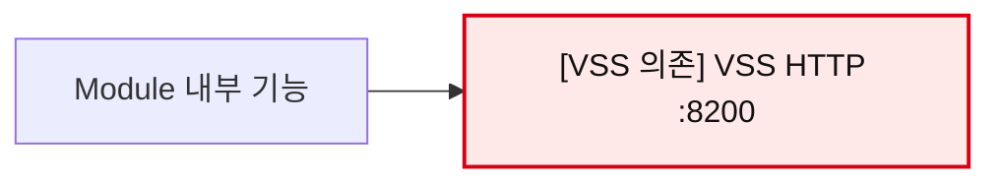

의존성 표기는 다음 의미로 사용합니다.

| 표기 | 의미 |
|---|---|
| **필수** | 해당 기능 실행 중 실제 VSS HTTP 호출이 필요함 |
| **연동 시 필수** | Module 기능 자체는 존재하지만 정상 운영 목적상 VSS가 호출자/상대방임 |
| **ID만 참조** | `vss_project_id` 같은 값을 저장하지만 실행 시 VSS 연결은 필요하지 않음 |
| **없음** | VSS 런타임과 무관하게 동작 가능 |

---

## 3. 전체 시스템 구조

```mermaid
flowchart LR
    Browser["Desktop / iPhone / iPad Browser"]
    Admin["Independent Admin Web :4180\nHTML + CSS + Vanilla JS + FastAPI BFF"]
    Backend["Snapshot Backend :8000\nFastAPI"]
    DB[("PostgreSQL :5432")]
    Git["Git Repository / Provider"]
    Ollama["Ollama :11434"]
    VSS["[VSS 의존] VSS :8200"]
    FS["Repository root / Immutable Snapshot filesystem"]

    Browser -->|HTTP(S)| Admin
    Admin -->|signed loopback request| Backend
    Backend --> DB
    Backend --> Git
    Backend --> FS
    Backend --> Ollama
    Backend --> VSS

    classDef vss fill:#ffe8e8,stroke:#d70015,stroke-width:2px,color:#111;
    class VSS vss;
```

Browser는 다음 대상에 직접 접근하지 않습니다.

- Snapshot Backend `:8000`
- VSS `:8200`
- Ollama `:11434`
- PostgreSQL `:5432`
- Git credentials
- 내부 materialized filesystem path

Admin Web은 same-origin BFF를 통해서만 Backend 관리 API를 호출합니다.

---

## 4. 기능별 의존성 매트릭스

| 기능 | Git | PostgreSQL | VSS | Ollama | 주요 진입점 |
|---|---:|---:|---|---:|---|
| Repository 등록 | 선택 | 필수 | **없음** | 없음 | Admin `/v1/admin/repositories` |
| GitHub metadata discovery | GitHub API | 선택 | **없음** | 없음 | `/v1/admin/repositories/discover` |
| Repository Sync | 필수 | 필수 | **없음** | 없음 | `/repositories/{id}/sync` |
| Tracked Branch 관리 | 필수 | 필수 | **ID만 참조** | 없음 | `/v1/admin/tracked-branches` |
| Commit catalog/history | 필수 | 필수 | **없음** | 없음 | `/repositories/{id}/commits` |
| Commit compare | 필수 | 필수 | **없음** | 없음 | `/repositories/{id}/compare` |
| Snapshot materialization | 필수 | 필수 | **없음** | 없음 | materialization service |
| Tracked Branch Index | 필수 | 필수 | **필수** | VSS 내부에서 사용 가능 | `/tracked-branches/{id}/index` |
| Snapshot Index | filesystem | 필수 | **필수** | VSS 내부에서 사용 가능 | `/snapshots/{id}/index` |
| Snapshot Retry/Reconcile | filesystem | 필수 | **필수** | VSS 내부에서 사용 가능 | indexing/retry/recovery |
| VSS source/revision API | 선택 | 필수 | **연동 시 필수** | 없음 | `/v1/internal/vss/*` |
| Chat observability gateway | 없음 | 필수 | **필수** | 관측 샘플링 | `POST /v1/chat` |
| VSS project catalog | 없음 | 선택 | **필수** | 없음 | `/v1/admin/vss/projects` |
| Ollama model control | 없음 | 선택 | **없음** | 필수 | `/v1/admin/runtime/models/*` |
| Module service restart | 없음 | 선택 | **없음** | 없음 | `/v1/admin/runtime/services/*` |
| Audit log | 없음 | 필수 | **없음** | 없음 | `/v1/admin/audit-logs` |
| VSS inbound failure log | 없음 | 필수 | **연동 시 필수** | 없음 | `/v1/admin/vss/request-failures` |

---

# 5. 기능별 Flow Chart

## 5.1 Repository 등록

**VSS 의존성: 없음**

Repository 등록은 metadata를 관리 DB에 저장하는 단계입니다. 등록만으로 VSS Index가 실행되지 않습니다.

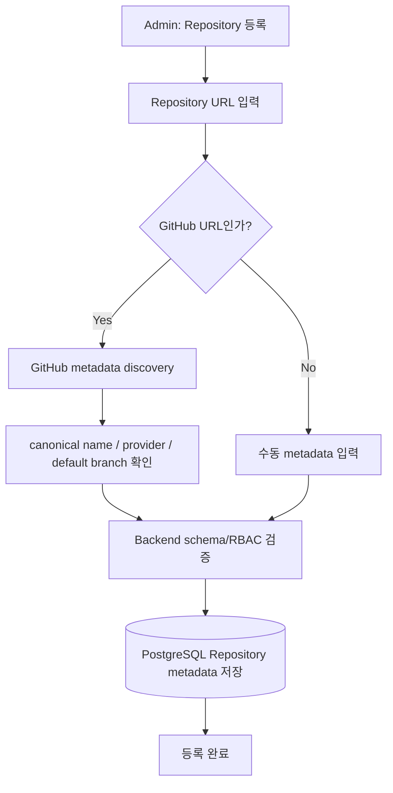

GitHub URL이면 공식 `default_branch`를 조회하며 `main`/`master`를 추측하지 않습니다.

---

## 5.2 Repository Sync / Branch 관측

**VSS 의존성: 없음**

Sync는 Git 상태를 관측하고 catalog를 갱신하는 기능입니다. **Sync가 VSS Index를 자동 호출하지 않습니다.**

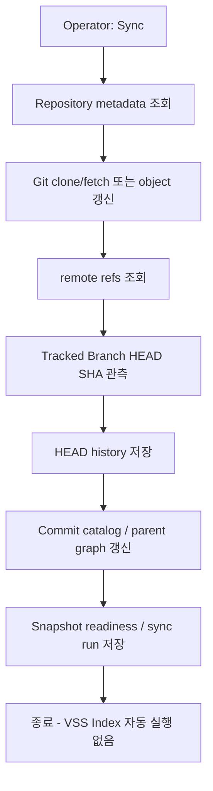

주요 구현 위치:

- `backend/features/repository_collection/`
- `backend/features/commit_catalog/`
- `backend/features/repositories/`

---

## 5.3 Tracked Branch 등록과 관리

**VSS 의존성: ID만 참조**

Tracked Branch는 exact `refs/heads/...`와 향후 사용할 `vss_project_id`를 연결합니다. CRUD 자체는 VSS가 내려가 있어도 가능합니다.

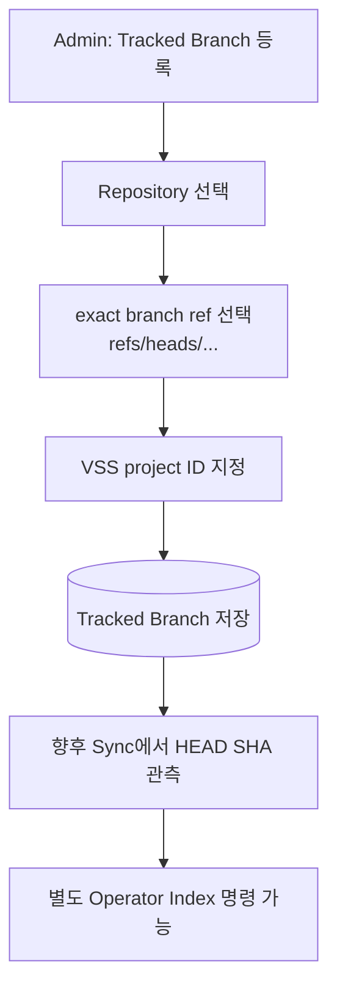

`vss_project_id`는 유사 이름을 자동 선택하지 않고 exact string을 보존합니다.

---

## 5.4 Branch Binding

**VSS 의존성: ID만 참조**

Frontend project/workspace와 Repository branch 및 exact VSS project ID 사이의 관리 binding입니다.

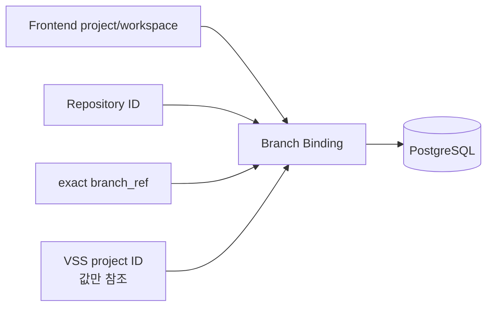

Module은 IP/User-Agent 등으로 Frontend identity를 추론하지 않습니다.

---

## 5.5 Commit Catalog / History

**VSS 의존성: 없음**

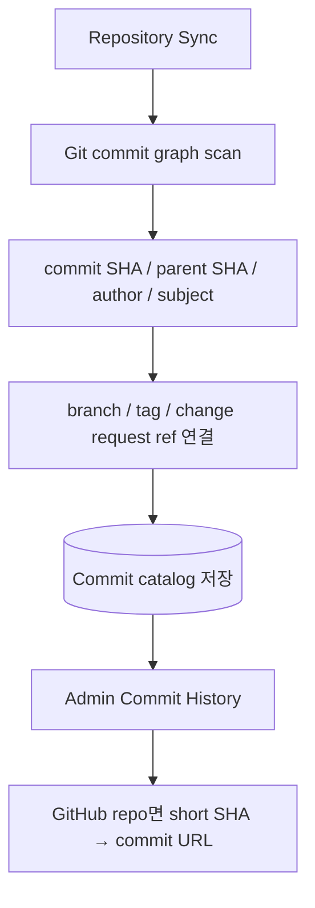

Admin Web에서는 short SHA를 표시하지만 full SHA를 정본으로 사용합니다.

---

## 5.6 Commit Compare

**VSS 의존성: 없음**

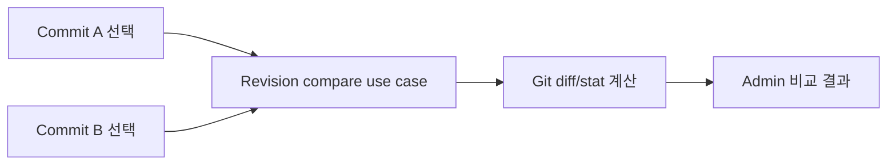

비교 결과가 자동으로 VSS reference revision을 선택하거나 Chat context를 변경하지 않습니다.

---

## 5.7 Commit / Revision Materialization

**VSS 의존성: 없음**

Materialization은 exact Git revision을 immutable tree로 만드는 단계입니다.

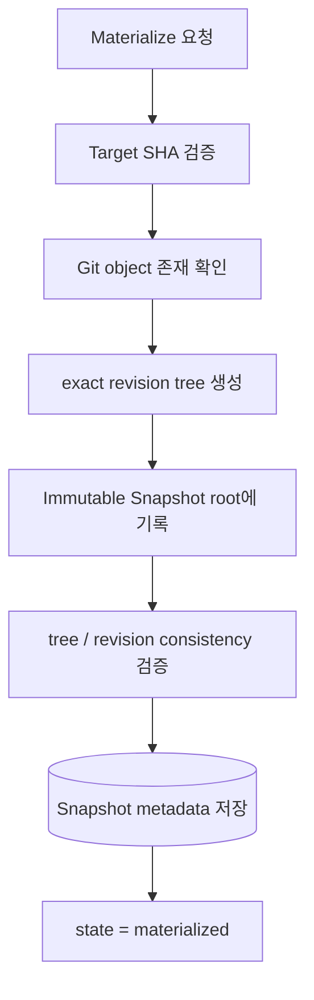

기본 운영 경로:

```text
SNAPSHOT_REPOSITORY_ROOT=/home/ubuntu/repos
SNAPSHOT_MATERIALIZATION_ROOT=/home/ubuntu/vss-snapshots
```

---

## 5.8 Tracked Branch Index

**VSS 의존성: 필수**

이 기능부터 실제 VSS `POST /index`가 필요합니다.

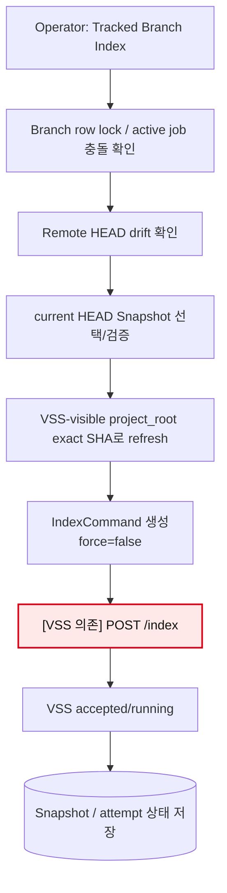

Remote HEAD가 기록된 target SHA와 달라지면 VSS-visible working tree를 바꾸기 전에 실패해야 합니다.

---

## 5.9 Historical Snapshot Index

**VSS 의존성: 필수**

과거 commit이나 current tracked HEAD가 아닌 revision은 immutable materialized tree를 VSS 입력으로 사용합니다.

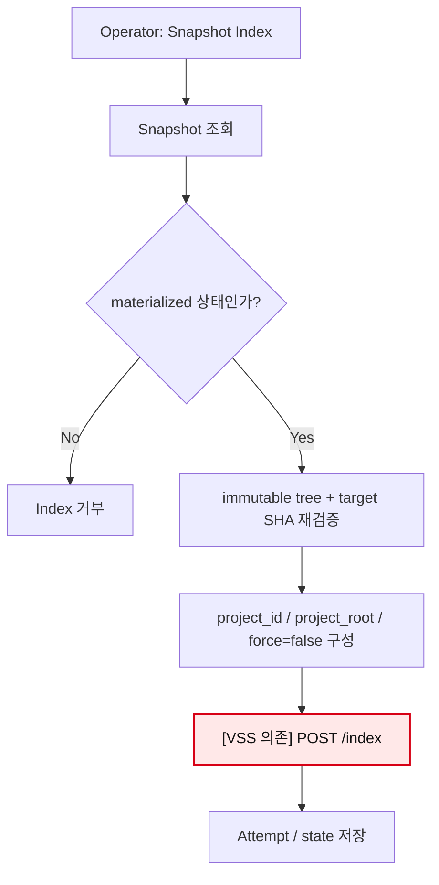

Browser는 `project_root`나 arbitrary revision override를 보내지 않습니다.

---

## 5.10 Index 상태 Reconcile / Completion

**VSS 의존성: 필수**

Module은 VSS가 `done`이라고 했다는 이유만으로 Snapshot을 완료 처리하지 않습니다. target commit 일치까지 확인합니다.

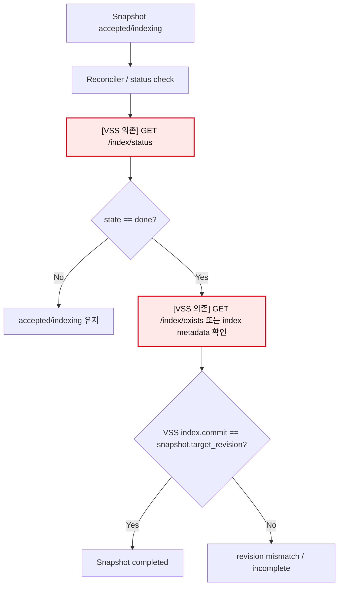

---

## 5.11 Snapshot Retry / Startup Recovery

**VSS 의존성: 필수**

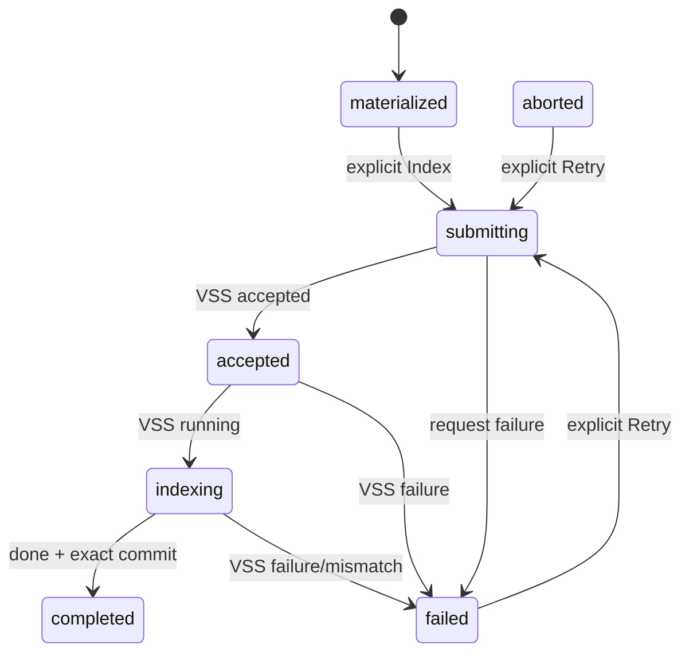

Retry는 동일 Snapshot target을 유지하고 attempt만 증가시키는 방향을 따릅니다. Startup recovery는 중간 상태를 다시 관측해 안전하게 수렴시키는 용도입니다.

---

## 5.12 VSS Source / Revision API

**VSS 의존성: 연동 시 필수**

이 경로는 Module이 VSS를 호출하는 방향이 아니라 **VSS가 Module을 호출하는 inbound integration**입니다.

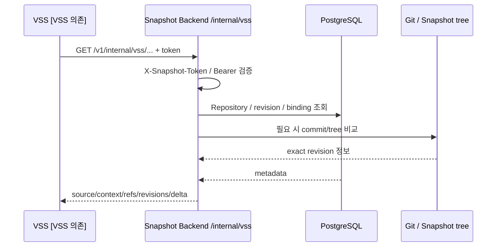

주요 endpoint:

- `GET /v1/internal/vss/capabilities`
- `GET /v1/internal/vss/repositories`
- `GET /v1/internal/vss/repositories/{repository_id}/commit-graph`
- `GET /v1/internal/vss/refs`
- `GET /v1/internal/vss/revisions`
- `GET /v1/internal/vss/source`
- `GET /v1/internal/vss/context`
- `GET /v1/internal/vss/delta`

별도 inbound token이 필요합니다.

```text
SNAPSHOT_VSS_API_TOKEN
```

---

## 5.13 Chat Observability Gateway

**VSS 의존성: 필수**

`POST /v1/chat`은 VSS Chat 의미론을 바꾸지 않는 transparent relay/observability 경계입니다.

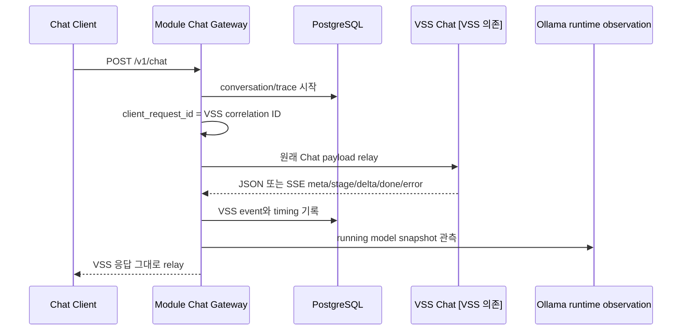

중요한 의미 경계:

- VSS retrieval/prompt/model/finalization을 Module이 바꾸지 않습니다.
- transcript 저장은 conversational memory가 아닙니다.
- requester/session/origin은 공식 입력 또는 VSS metadata가 없으면 추측하지 않습니다.
- VSS unavailable이면 gateway는 관측 오류를 기록하고 503을 반환할 수 있습니다.

---

## 5.14 Ollama Runtime Model Control

**VSS 의존성: 없음**

Ollama lifecycle은 VSS와 별개로 Backend가 직접 관리합니다.

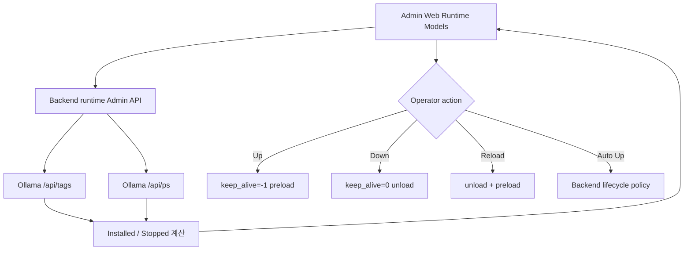

현재 Auto Up 정책은 process-local이므로 Backend restart 후 영속되지 않습니다.

---

## 5.15 Module Service Restart

**VSS 의존성: 없음**

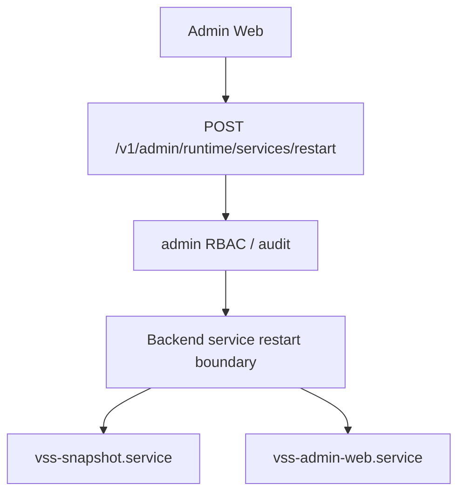

UI가 직접 `systemctl`을 실행하지 않습니다.

---

## 5.16 Audit / VSS Request Failure Observability

**Audit Log VSS 의존성: 없음**

**VSS Request Failure 화면 VSS 의존성: 연동 시 필수**

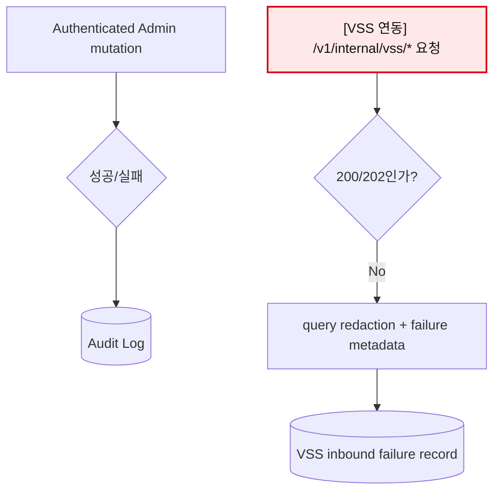

Credential, file content, raw secret 값은 감사 화면에 기록하지 않습니다.

---

# 6. Admin Web 사용 흐름

Admin Web은 독립 브라우저 애플리케이션이며 기본 포트는 `4180`입니다.

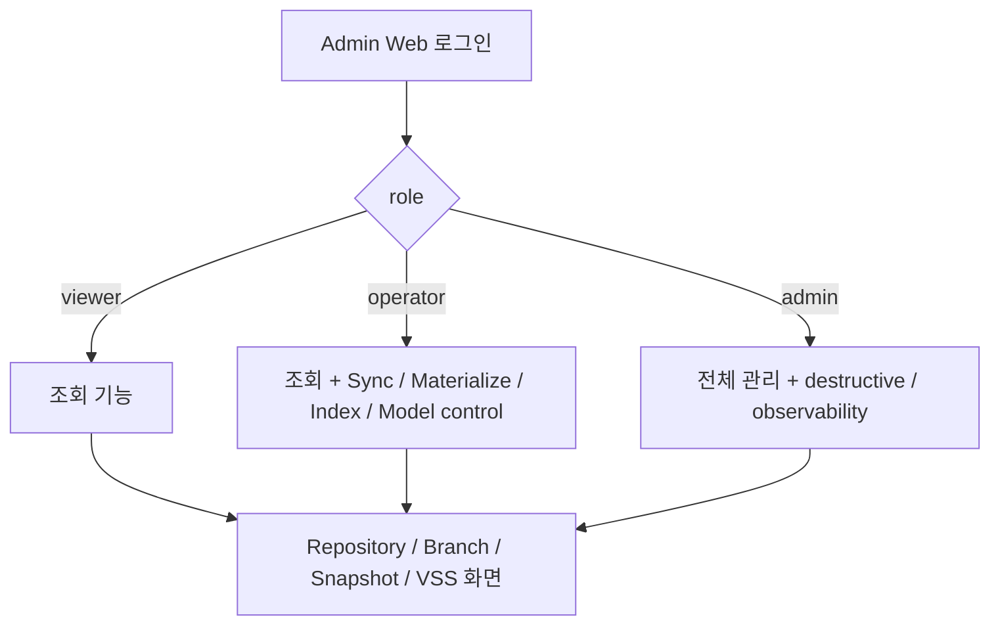

### 대표 운영 사용 순서

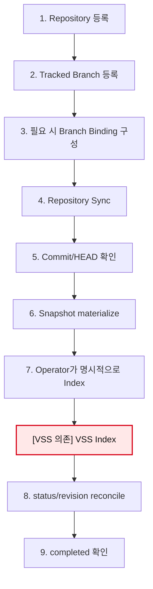

### Admin Web UX

현재 UI 세대는 **Apple Liquid Glass UX v4**입니다.

- Command Palette: `⌘K`, `Ctrl+K`, `/`
- desktop 3-column split view
- Selection Inspector
- Activity Center
- keyboard row navigation
- View Transition API + fallback
- iPhone/iPad responsive layout
- iPhone에서 off-canvas navigation
- bottom-sheet Inspector/Controls/Activity
- mobile table → record card 변환
- `viewport-fit=cover`
- `safe-area-inset-*`
- `100dvh`
- `-webkit-backdrop-filter`
- reduced motion/transparency/contrast 대응

상세 내용은 `docs/agent/24_ADMIN_WEB_TECHNICAL_REFERENCE.md`를 참고하십시오.

---

# 7. 개발 과정

## 7.1 변경 전 확인 순서

새 작업을 시작할 때 다음 순서를 권장합니다.

```mermaid
flowchart TD
    A["요구사항 확인"] --> B["module/AGENTS.md 읽기"]
    B --> C["docs/architecture/ARCHITECTURE.md 확인"]
    C --> D["관련 agent 문서 확인"]
    D --> E["실제 route/service/store 코드 대조"]
    E --> F{"VSS 의미론에 영향?"}
    F -->|Yes| G["VSS source/API 계약과 exact semantics 검토"]
    F -->|No| H["Module 내부 변경 범위 확정"]
    G --> H
    H --> I["테스트 우선 또는 회귀 계약 추가"]
    I --> J["구현"]
    J --> K["Targeted + Full verification"]
```

### 반드시 먼저 읽을 문서

- `AGENTS.md`
- `docs/architecture/ARCHITECTURE.md`
- `docs/agent/05_IMPLEMENTATION_PLAN.md`
- `docs/agent/09_CURRENT_AND_NEXT_BRIEFING.md`
- Admin Web 작업: `docs/agent/24_ADMIN_WEB_TECHNICAL_REFERENCE.md`
- VSS source API 작업: `docs/agent/13_VSS_SOURCE_API.md`
- Commit/history 작업: `docs/agent/16_COMMIT_HISTORY_AND_COMPARISON.md`
- Chat observability 작업: `docs/agent/23_CHAT_OBSERVABILITY.md`

---

## 7.2 기능 구현 레이어

새 기능은 가능하면 다음 경계를 유지합니다.

```mermaid
flowchart TD
    HTTP["Router / HTTP contract"] --> UC["Use case / Service"]
    UC --> DOMAIN["Domain state / validation"]
    UC --> STORE["Store / repository"]
    UC --> EXT["External integration"]
    STORE --> DB[("PostgreSQL")]
    EXT --> GIT["Git"]
    EXT --> OLLAMA["Ollama"]
    EXT --> VSS["[VSS 의존 기능만] VSS"]

    classDef vss fill:#ffe8e8,stroke:#d70015,stroke-width:2px,color:#111;
    class VSS vss;
```

권장 원칙:

- Router에서 복잡한 Git/VSS orchestration을 직접 구현하지 않기
- exact SHA/ref validation을 service/domain에서 유지하기
- destructive operation은 RBAC + audit 유지하기
- VSS response를 임의로 추론하지 않기
- Browser가 internal filesystem path를 결정하지 못하게 하기
- retry/recovery는 idempotency와 locking을 우선하기

---

## 7.3 데이터베이스 변경 개발 흐름

```mermaid
flowchart LR
    MODEL["ORM/schema 변경"] --> MIG["Alembic migration"]
    MIG --> STORE["Store 변경"]
    STORE --> TEST["Unit / migration test"]
    TEST --> PG["PostgreSQL validation"]
```

기존 migration history를 rewrite하지 말고 새 revision을 추가하는 방향을 사용합니다.

---

## 7.4 VSS 의존 기능 개발 흐름

VSS 의존 기능을 수정할 때는 일반 Module 기능보다 검증 범위를 더 좁게 잡아야 합니다.

```mermaid
flowchart TD
    A["VSS 관련 요구사항"] --> B["현재 VSS 실제 API/source 확인"]
    B --> C["Module이 소유할 책임만 분리"]
    C --> D["VSS가 노출하지 않은 값 추론 금지"]
    D --> E["request/response fixture 및 mock 테스트"]
    E --> F["exact SHA/project_root 검증"]
    F --> G["실 VSS 환경 smoke/E2E"]
```

특히 다음 의미론은 VSS 소유입니다.

- Chat retrieval
- prompt 구성
- embedding
- model 선택
- generation
- final answer
- Index 내부 chunking/embedding/vector build

Module은 해당 의미론을 복제하지 않습니다.

---

# 8. 로컬 개발 환경

## 8.1 Python 환경

지원 Python:

```text
>=3.10,<3.15
```

Windows 예시:

```powershell
cd module
python -m venv .venv
.venv\Scripts\python.exe -m pip install -e ".[dev]"
```

Linux 예시:

```bash
cd module
python3 -m venv .venv
.venv/bin/python -m pip install -e '.[dev]'
```

주요 Python dependency:

- FastAPI
- httpx2
- Pydantic Settings
- SQLAlchemy 2.x
- Alembic
- asyncpg
- Uvicorn
- pwdlib[argon2]

---

## 8.2 Snapshot Backend 실행

환경 설정 후:

```powershell
cd module
.venv\Scripts\python.exe -m uvicorn main:app --host 127.0.0.1 --port 8000
```

기본 구조:

```text
Snapshot Backend  http://127.0.0.1:8000
VSS               http://127.0.0.1:8200
PostgreSQL        127.0.0.1:5432
Ollama            http://127.0.0.1:11434
```

VSS가 필요한 기능을 개발하지 않는다면 Repository/commit/materialization 계층은 VSS 없이도 테스트 가능합니다.

---

## 8.3 Admin Web 실행

Admin Web은 정적 UI와 same-origin BFF를 `4180`에서 제공합니다.

```powershell
cd module
.venv\Scripts\python.exe -m admin_web.passwords

$env:ADMIN_WEB_USERS_FILE = 'C:\secure\admin-users.json'
$env:ADMIN_WEB_SESSION_SECRET = '<32-byte-or-longer-secret>'
$env:ADMIN_WEB_BACKEND_SERVICE_TOKEN = '<backend-service-token>'
$env:ADMIN_WEB_BACKEND_SIGNING_SECRET = '<different-32-byte-signing-secret>'
$env:ADMIN_WEB_SECURE_COOKIES = 'false' # local HTTP 개발에서만

.venv\Scripts\python.exe -m admin_web
```

브라우저:

```text
http://127.0.0.1:4180/
```

Admin Web은 Backend loopback URL만 BFF 대상으로 허용합니다.

---

# 9. 개발 검증

기본 검증 순서:

```mermaid
flowchart LR
    C["compileall"] --> R["Ruff"]
    R --> T["targeted pytest"]
    T --> F["full pytest"]
    F --> D["git diff --check"]
    D --> S["sandbox / runtime validation"]
```

Windows:

```powershell
cd module
.venv\Scripts\python.exe -m compileall -q backend admin_web alembic tests scripts
.venv\Scripts\python.exe -m ruff check backend admin_web tests alembic scripts
.venv\Scripts\python.exe -m pytest -q
```

Admin Web JavaScript syntax:

```powershell
node --check admin_web/app.js
```

Git whitespace:

```powershell
git diff --check -- module/
```

PostgreSQL 17 검증:

```powershell
.venv\Scripts\python.exe scripts\verify_postgresql_17.py
```

운영 환경을 건드리지 않는 sandbox 검증:

```bash
./scripts/verify_module_sandbox.sh
```

실제 AWS/systemd 검증은 `docs/agent/19_AWS_RUNTIME_VERIFICATION.md`를 따릅니다.

---

# 10. 배포 / 운영 흐름

동일 AWS 인스턴스 기본 경계:

```mermaid
flowchart LR
    B["Browser"] -->|":4180"| AW["vss-admin-web.service"]
    AW -->|"127.0.0.1:8000"| SB["vss-snapshot.service"]
    SB -->|"127.0.0.1:5432"| PG[("PostgreSQL")]
    SB -->|"127.0.0.1:11434"| OL["Ollama"]
    SB -->|"127.0.0.1:8200"| VS["[VSS 의존 기능] vss-server.service"]

    classDef vss fill:#ffe8e8,stroke:#d70015,stroke-width:2px,color:#111;
    class VS vss;
```

기본 포트:

| Service | Port | 외부 공개 |
|---|---:|---|
| Admin Web | `4180` | 승인된 보안 그룹/VPN/TLS 경계에서 가능 |
| Snapshot Backend | `8000` | loopback only |
| VSS | `8200` | 일반적으로 loopback/internal |
| Ollama | `11434` | loopback/internal |
| PostgreSQL | `5432` | loopback/internal |

Nginx는 필수 구성 요소가 아닙니다. 공개 HTTPS가 필요하면 ALB 등 승인된 TLS termination을 앞에 둡니다.

### UI-only Admin Web 변경 배포

HTML/CSS/JS만 변경된 경우 일반적으로:

```bash
cd /home/ubuntu/vss_server
git pull
sudo systemctl restart vss-admin-web.service
```

### Backend 변경 배포

Backend Python 코드가 변경된 경우:

```bash
cd /home/ubuntu/vss_server
git pull
sudo systemctl restart vss-snapshot.service
```

Admin Web BFF route/allowlist도 함께 변경됐다면 `vss-admin-web.service`도 재시작합니다.

DB migration이 추가된 경우에는 해당 release의 migration 절차를 먼저 확인하십시오.

---

# 11. 장애 확인 순서

```mermaid
flowchart TD
    A["기능 실패"] --> B{"Admin Web 자체가 열리는가?"}
    B -->|No| AW["vss-admin-web.service / :4180 확인"]
    B -->|Yes| C{"Backend health 정상?"}
    C -->|No| SB["vss-snapshot.service / :8000 확인"]
    C -->|Yes| D{"해당 기능이 VSS 의존인가?"}
    D -->|No| LOCAL["DB / Git / Ollama / permission / audit 확인"]
    D -->|Yes| V["[VSS 의존] vss-server.service / :8200 / VSS response 확인"]
    V --> RID["X-Request-ID / trace / Snapshot attempt 대조"]
    LOCAL --> RID

    classDef vss fill:#ffe8e8,stroke:#d70015,stroke-width:2px,color:#111;
    class V vss;
```

Admin `/` 확인은 `HEAD`가 아니라 `GET`을 사용하십시오. `/` route는 GET 기반이므로 `curl -I` 결과의 405를 서비스 장애로 판단하면 안 됩니다.

```bash
curl -sS -o /dev/null -w '%{http_code}\n' http://127.0.0.1:4180/
curl -fsS http://127.0.0.1:8000/v1/health/ready
```

---

# 12. 디렉터리 구조

```text
vss_server/
├─ vss/                             # VSS main 소유, module 작업에서 수정하지 않음
└─ module/
   ├─ backend/
   │  ├─ bootstrap/                 # composition root
   │  ├─ core/                      # config/errors/logging
   │  ├─ features/
   │  │  ├─ admin/                  # Admin API / audit / restart
   │  │  ├─ chat_observability/     # transparent VSS Chat relay/trace
   │  │  ├─ commit_catalog/         # commit graph/catalog
   │  │  ├─ frontend_proxy/         # Frontend read proxy
   │  │  ├─ health/                 # health/readiness
   │  │  ├─ indexing/               # VSS index orchestration/retry/recovery
   │  │  ├─ materialization/        # immutable exact tree
   │  │  ├─ repositories/           # repository metadata/store/discovery
   │  │  ├─ repository_collection/  # clone/fetch/sync
   │  │  ├─ snapshots/              # Snapshot state/store
   │  │  ├─ vss_sources/            # VSS inbound source API
   │  │  └─ workspace_overlays/     # compatibility overlay boundary
   │  └─ infrastructure/
   ├─ admin_web/                    # Independent browser Admin Web :4180
   ├─ alembic/                      # DB migrations
   ├─ docs/
   ├─ ops/
   ├─ scripts/
   ├─ tests/
   ├─ AGENTS.md
   ├─ main.py
   └─ pyproject.toml
```

---

# 13. 기술 스택 요약

| Layer | Technology |
|---|---|
| Backend API | FastAPI |
| ASGI | Uvicorn |
| HTTP integration | httpx2 |
| Validation/config | Pydantic / Pydantic Settings |
| ORM | SQLAlchemy 2.x |
| Migration | Alembic |
| DB driver | asyncpg |
| Database | PostgreSQL |
| Admin Web markup | HTML5 |
| Admin Web styling | CSS3 / Liquid Glass responsive system |
| Admin Web client | Vanilla JavaScript |
| Auth password hashing | Argon2 via `pwdlib[argon2]` |
| Git integration | system Git + repository collection services |
| LLM runtime control | Ollama API |
| Vector/RAG/Chat owner | VSS server |
| Test | pytest |
| Lint | Ruff |

Admin Web에는 React/Vue/Next.js, npm bundler, external CDN이 필요하지 않습니다.

---

# 14. 현재 의미론적 경계

### Module이 소유하는 것

- Repository metadata
- Branch tracking
- Git fetch/ref/HEAD 관측
- commit catalog/graph
- exact Snapshot materialization
- Snapshot state/attempt
- explicit Index orchestration
- retry/recovery/reconciliation
- Admin API/BFF/UI
- audit
- VSS source provenance API
- Chat observability relay/trace persistence
- Ollama lifecycle control

### VSS가 소유하는 것

- Index 내부 file processing 정책
- chunking
- embedding
- lexical/BM25 처리
- vector store build/promote
- Chat retrieval
- prompt
- model selection
- generation
- finalization

```mermaid
flowchart LR
    M["Module\nSource / Snapshot / Orchestration / Observability"] --> V["[VSS 의존 영역]\nIndex semantics / Retrieval / Prompt / Generation"]
    classDef vss fill:#ffe8e8,stroke:#d70015,stroke-width:2px,color:#111;
    class V vss;
```

이 경계를 넘는 기능 변경은 먼저 architecture 문서를 갱신하고 VSS 실제 계약을 확인해야 합니다.

---

# 15. 관련 문서

| 문서 | 목적 |
|---|---|
| `AGENTS.md` | module 작업 지침과 변경 경계 |
| `docs/architecture/ARCHITECTURE.md` | 전체 아키텍처 정본 |
| `docs/agent/05_IMPLEMENTATION_PLAN.md` | 구현 단계/순서 |
| `docs/agent/09_CURRENT_AND_NEXT_BRIEFING.md` | 현재/다음 작업 브리핑 |
| `docs/agent/13_VSS_SOURCE_API.md` | VSS source/revision API |
| `docs/agent/16_COMMIT_HISTORY_AND_COMPARISON.md` | commit history/compare |
| `docs/agent/18_MODULE_SANDBOX_VALIDATION.md` | sandbox validation |
| `docs/agent/19_AWS_RUNTIME_VERIFICATION.md` | AWS runtime 검증 |
| `docs/agent/22_REPOSITORY_ROOT_DEPLOYMENT.md` | repository root 배포 경계 |
| `docs/agent/23_CHAT_OBSERVABILITY.md` | Chat observability 계약 |
| `docs/agent/24_ADMIN_WEB_TECHNICAL_REFERENCE.md` | Admin Web 기술/UX v4 상세 레퍼런스 |
| `docs/architecture/ADMIN_SERVICE_RESTART.md` | Admin service restart 계약 |
| `docs/architecture/REPOSITORY_WORKTREE_NAMESPACE.md` | repository/worktree namespace |

---

## 요약

Module의 기본 사용 흐름은 다음과 같습니다.

```mermaid
flowchart LR
    REG["Repository 등록"] --> SYNC["Git Sync"]
    SYNC --> CAT["Commit catalog"]
    CAT --> MAT["Exact Snapshot materialize"]
    MAT --> IDX["명시적 Index"]
    IDX --> VSS["[VSS 의존] VSS"]
    VSS --> REC["Status reconcile"]
    REC --> DONE["Exact commit completed"]

    classDef vss fill:#ffe8e8,stroke:#d70015,stroke-width:2px,color:#111;
    class VSS vss;
```

**Repository 수집과 Snapshot 생성까지는 VSS 없이 동작할 수 있고, 실제 Index/Chat relay/VSS catalog 연동 단계에서만 VSS 런타임이 필수입니다.**
