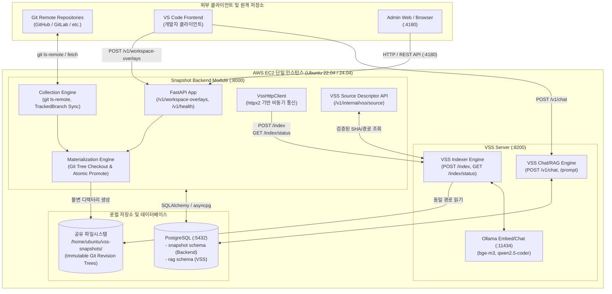
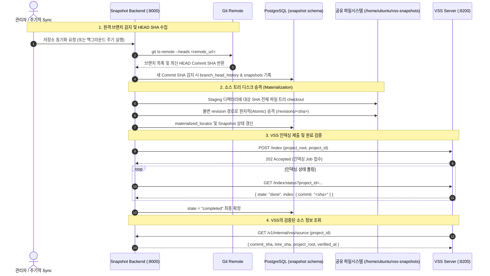

# Vision Snapshot Backend Module

이 디렉터리는 `vss_server/main`의 VSS(Vector Search Server) 런타임과 소스코드가 섞이지 않는 **독립 Snapshot Backend 모듈**입니다.  
원격 Git 저장소와 추적 브랜치의 최신 Commit SHA를 수집하고, 전체 소스 트리를 불변(Immutable) 디렉터리로 Materialize한 후 VSS 서버의 인덱싱(`POST /index`)에 공급하는 역할을 담당합니다.

---

## 🏛️ 시스템 전체 아키텍처 (System Architecture)



---

## 🔄 데이터 수집 및 인덱싱 흐름 (Data & Indexing Flow)



---

## 📁 디렉터리 경계 및 컴포넌트 구조

```text
vss_server/
├── vss/                            # VSS Server 메인 소유 (이 모듈에서 수정하지 않음)
└── module/                         # Snapshot Backend 전용 작업 공간
    ├── alembic/                    # PostgreSQL snapshot 스키마 마이그레이션
    │   └── versions/
    │       ├── 0001_initial_snapshot_schema.py
    │       └── 0004_collection_core.py
    ├── backend/
    │   ├── core/                   # 설정(Settings), 보안 에러 처리, 로깅
    │   ├── features/
    │   │   ├── collection/         # 저장소 탐색(git ls-remote), 브랜치 추적, 동기화 오케스트레이터
    │   │   ├── materialization/    # Git Base Tree 복원, Delta 적용, 불변 디스크 승격 엔진
    │   │   ├── snapshots/          # Snapshot 수명주기, VSS 소스 조회 디스크립터 API
    │   │   └── workspace_overlays/ # Frontend delta 수신 및 보안 경로 검증
    │   ├── infrastructure/
    │   │   └── database/           # SQLAlchemy Base, Engine, Session, ORM 모델 8종
    │   └── integrations/
    │       └── vss/                # VSS HTTP 클라이언트 (VssHttpClient, schemas, errors)
    ├── docs/agent/                 # 에이전트 인계 문서 및 설계 명세 (01~14)
    ├── scripts/                    # AWS 운영 및 로컬 통합 검증 스크립트
    ├── tests/                      # pytest 자동화 테스트 스위트 (123+ passed)
    ├── pyproject.toml              # Python >=3.10 호환 의존성 정의
    └── README.md                   # 모듈 아키텍처 및 안내서
```

---

## 🌐 동일 AWS 인스턴스 주소 및 포트 맵

모든 내부 서비스는 AWS EC2 단일 인스턴스 내에서 **루프백(`127.0.0.1`)**을 통해 통신합니다:

| 서비스 / 구성요소 | 바인드 주소 / 포트 | 프로토콜 | 설명 |
|---|---|:---:|---|
| **Snapshot Backend** | `127.0.0.1:8000` | HTTP | FastAPI 기반 Snapshot 및 수집 백엔드 |
| **VSS Server** | `127.0.0.1:8200` | HTTP | 벡터 검색 및 RAG 인덱서 서버 |
| **Admin Web / Proxy** | `0.0.0.0:4180` | HTTP(S) | 관리자 웹 인터페이스 / OAuth2-Proxy 포트 |
| **PostgreSQL** | `127.0.0.1:5432` | TCP | `snapshot` 스키마(Backend) & `rag` 스키마(VSS) |
| **Ollama Service** | `127.0.0.1:11434` | HTTP | 임베딩(`bge-m3`) 및 LLM 서빙 |

---

## 🛠️ 개발 및 로컬 검증 명령어

```powershell
cd module

# 가상환경 생성 및 의존성 설치
python -m venv .venv
.\.venv\Scripts\python.exe -m pip install -e ".[dev]"

# 문법 컴파일 검사
.\.venv\Scripts\python.exe -m compileall -q backend alembic tests scripts

# 린터 및 스타일 검사 (100% clean)
.\.venv\Scripts\python.exe -m ruff check backend tests alembic scripts

# 전체 자동화 테스트 실행 (123+ passed)
.\.venv\Scripts\python.exe -m pytest -q
```
